# Free Touch

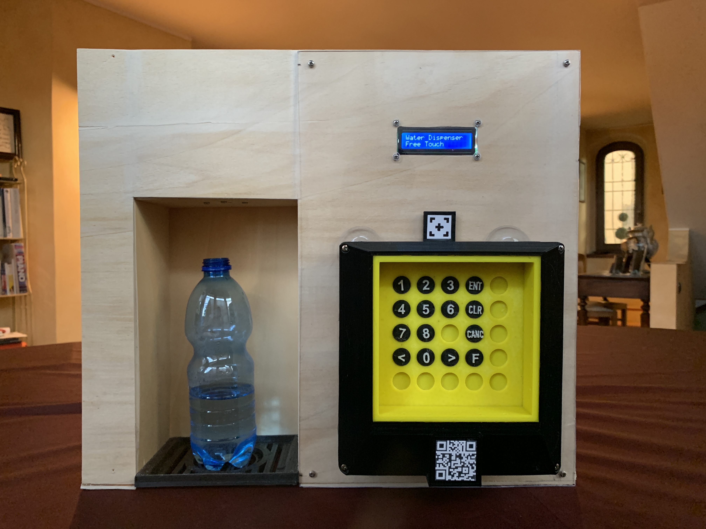

Free touch (which was tought during Covid 19) is a simple device that can be adapted to any keypad layout (like the ones of water dispenser machines, elevators and so on) and once mounted on top of it can press the buttons for you, avoiding you to have to touch anything. You can tell it the will to press a button by putting your finger closer to the target or by connecting with the smartphone via bluetooth

Free Touch can be adapted to the desired keypad layout just by taking a picture of it: an algorithm will recognize the buttons and calculate their position. Free Touch is then equipped with a tip that can move into the space and physically press buttons for you

Of course it would be easier to design products (water dispenser machines, elevators, ...) already equipped with bluetooth connectivity or non-touch user interaction, however there are so many machines that rely upon contact already that it would require an enormous effort to modifying them all

Okay this was me trying to make it look useful. It's not but conversely I think it's a nice little concentrate of engigneering: both electronics, mechanics and Informatics
Is that kind of device that solves a very simple problem in a very complicated way: wouldn't it be easier to design sime kind of stick you can hold in your hand and press the buttons with?
I still think that it was worth designing, building and programming it because it allowed me to enhance my knoledge of computer vision, 3d printing, mechanical design and embedded programming and was so much fun!

## Mobile App
For configuring the device (the process is explained in the next section) and for using it, I developed an application for smartphones using the Flutter framework so that it can be compiled for IOS and Android natively. The first version of the app used filtering, contrast enhancing and contour detection algorithm developed by me. In the second version I rightfully decided to integrate OpenCV which, of course, made the development much easier. Yet I think is a good way of proceeding: first develope something that work (doesn't have to be perfect) from scratch, then start using a library or a framework: first you learn from the ground up how something work and second but most important you can really appreciate those people that spend theire lives developing and then distributing theire work as open source. Many thanks to them!

Okay back to where I left...

## Configuration 
Before I mentioned that the device could be configured by taking a picture of it and can be controlled through bluetooth
Usually the configuration process confure people so I will try to explain how it works here:
- first of all you have to put a tag above the keypad you whish to configure (it will act as a reference to the algorithm to determine position and sizes)

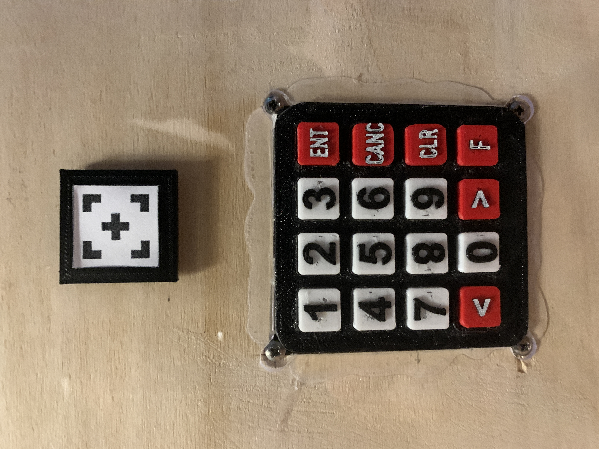
- than you open the application and connect to the device by scanning it's QR code

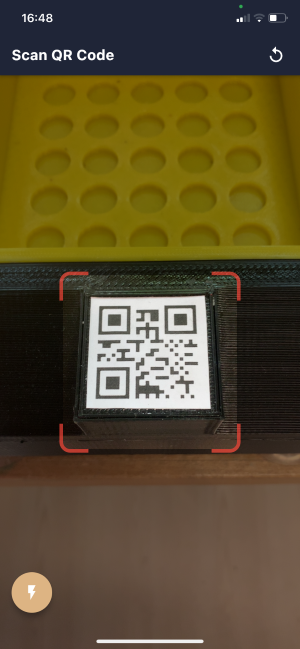
- you take a picture of the keypad icluding the tag and the algorithm will automatically detect close edges that resembles pushbuttons

- Select the buttons you whish to configure

- Install the device aligning the slot on the top with the tag (this is necessary since the tag is the reference of the whole system and its position must be known)

Well Done! you can now press buttons at a distance, like magic!

this is the screen that appears when you connect to the device

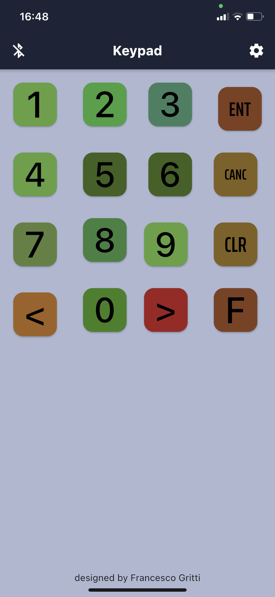

## IR Sensor
on the front of the device there is a configurable matrix IR sensor matrix that allow the user to press the button by putting it's finger closer to it

The matrix is configurable in the meaning that behind each cell scanned by the IR sensors there is a slot where you can put an insert with written the actual button it corresponds to. This way the user can interact with it in a very natural way

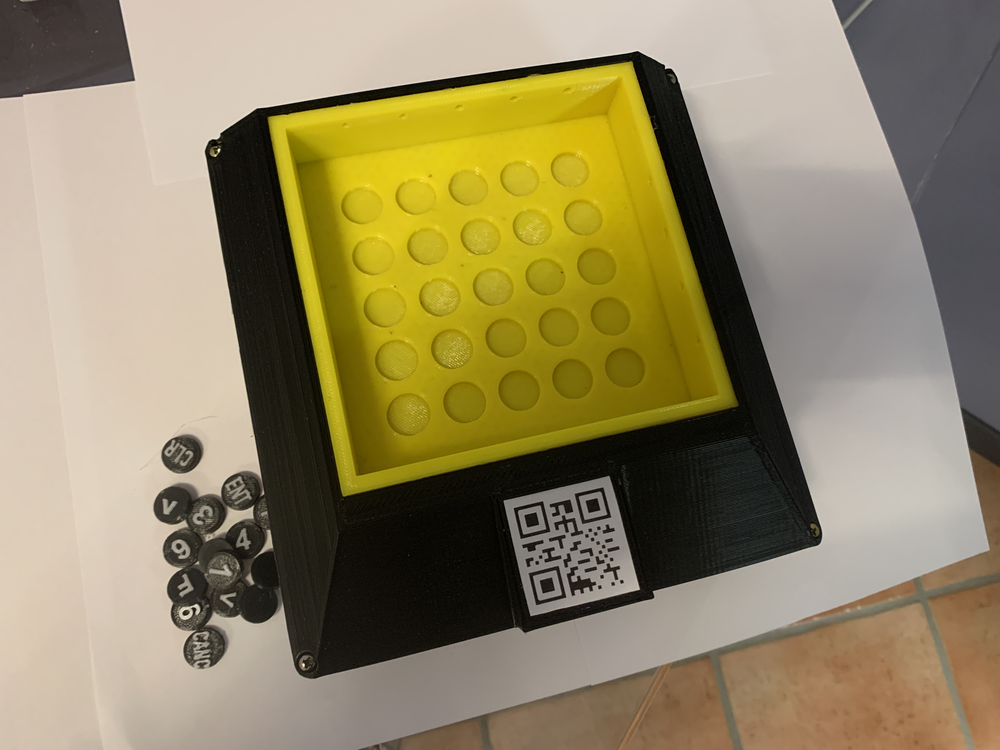

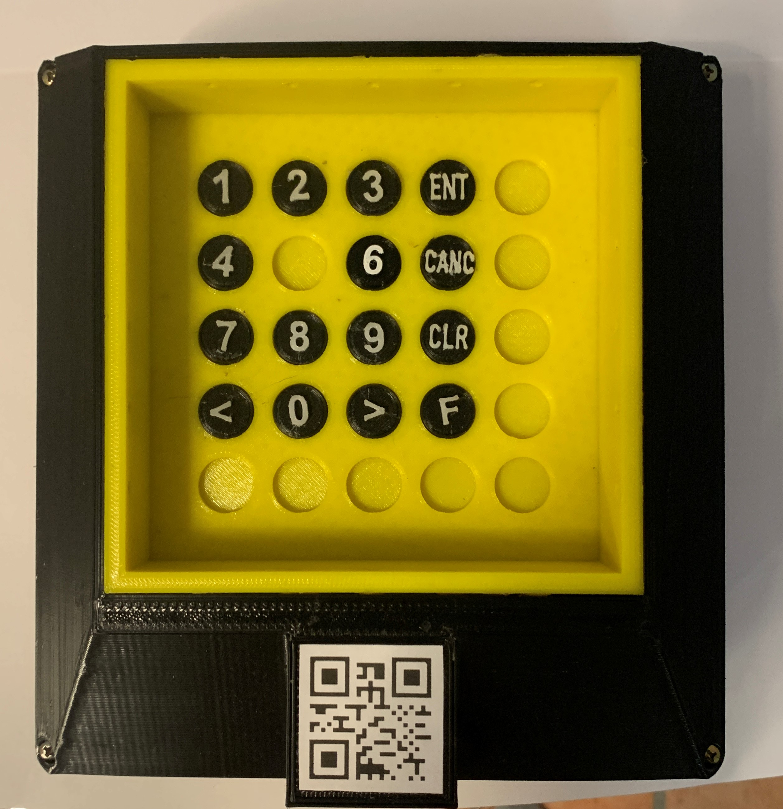

## Mechanics

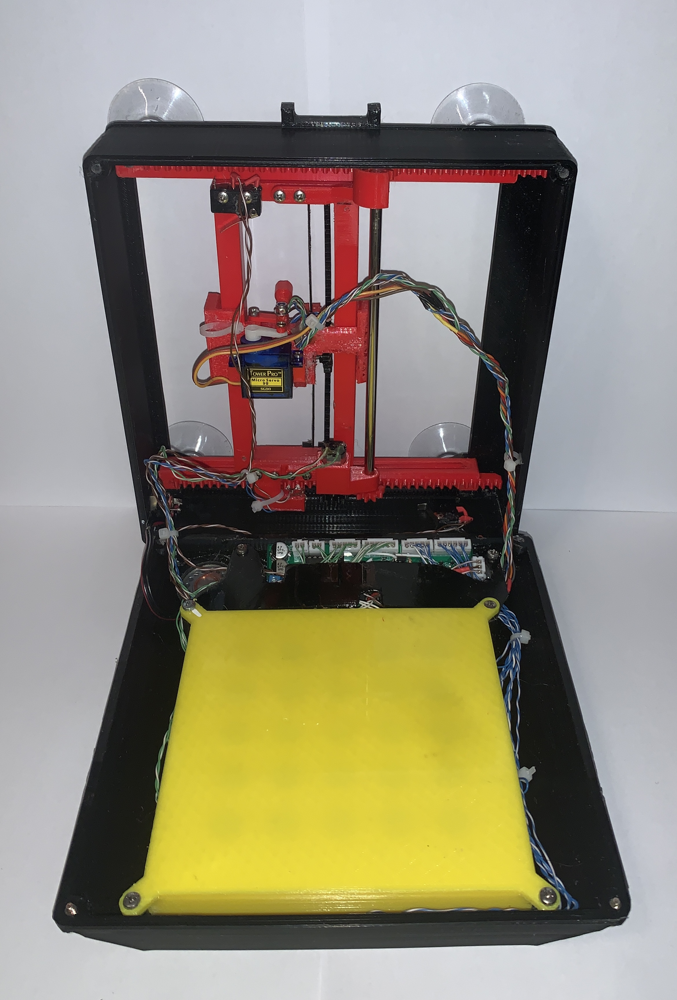

All the mechanical parts are 3d printed using PETG. I decided to use this material since there are parts that slide on each other and PETG felt like a better material for this purpose in terms of friction with respect to PLA or ABS, and I didn't want to use PLA since it can easily deform even at not so high temperatures

I used little DC motors with reduction which turned out to be perfect for this application: small, light way yet they have good torque and speed

The axis position is monitored by optical encoder that were 3D printed int the structure itself

the buttons are effectively pressed by a sg90 servo motor

## Electronics
And now the time for electronics

### Microcontroller
As for the microcontroller I have used the PIC16LF18456 which has a generous amount of peripherals, RAM and program memory, more than enough for this project

### Analog IR Signal Conditioning
IR sensor are driven at 1kHz so that the slow varying influence of light of the environment can be filtered out with active filters. no one wants a button to be pressed just because a cloud covered the sun for frew seconds!

### Bluetooth
The bluetooth connectivity is handled through Microchip's module ... communicating with the microcontroller via AT commands over UART

### PCB
I was a bit in a rush (as every time when you have a deadline to the project) and when designing the PCB I made some mistakes (that is why there should be always a version 2.0 of a PCB) but luckily that happens so frequently that even if it was two years ago I was already quite good at PCB rework
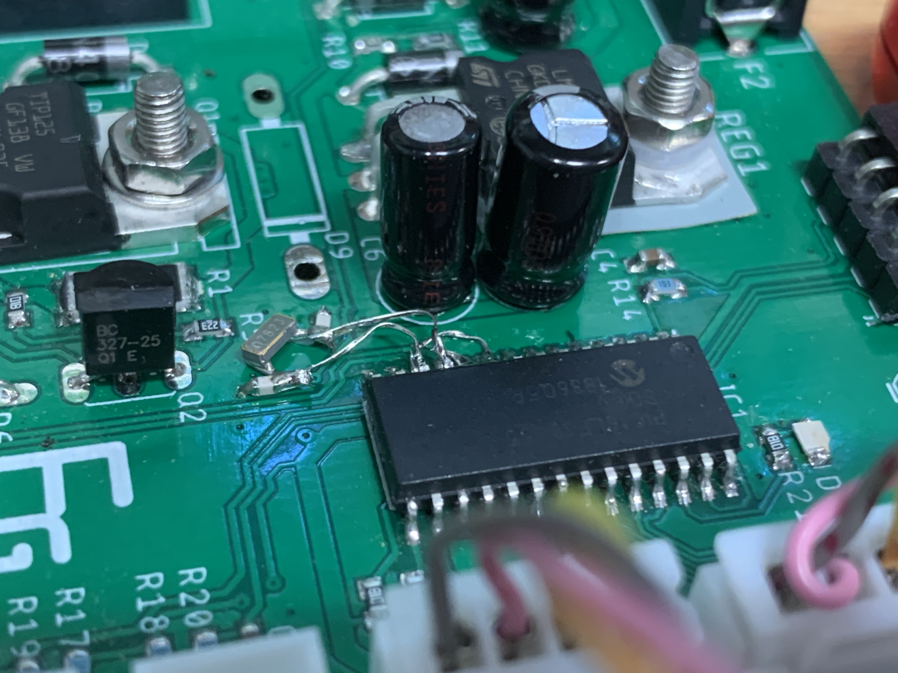
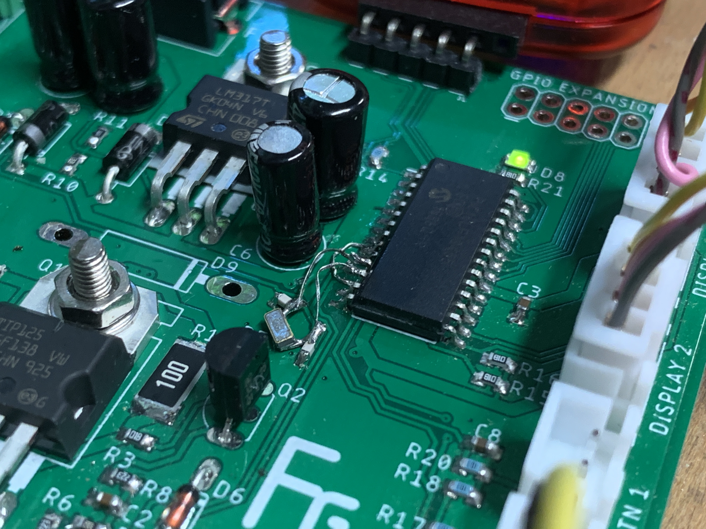

## Cable management
I was almost forgetting (as I did while designing the device): cable management
In fact it's simple to overlook during design at cable management but it is most of the times critical. In this project everything had to fit in a tiny space and the axis had to move freely for almost the entire widtrh and length of the device. If even a tiny cable got stucked somewhere in the internal structure, the tip was blocked and many bad things can happen
Luckily after some trial and errors I managed to fix the cable in a very lovely way that was nicely organized and allowed the axis to move smoothly

## Version 1.0

Well all I have been talking about and showing so far was version 2.0 of the device. Of course there have been a version 1.0 that was so ugly it almost feels a modern art creation
The concept is exactly the same, just messier. I will attach some pictures of it here 

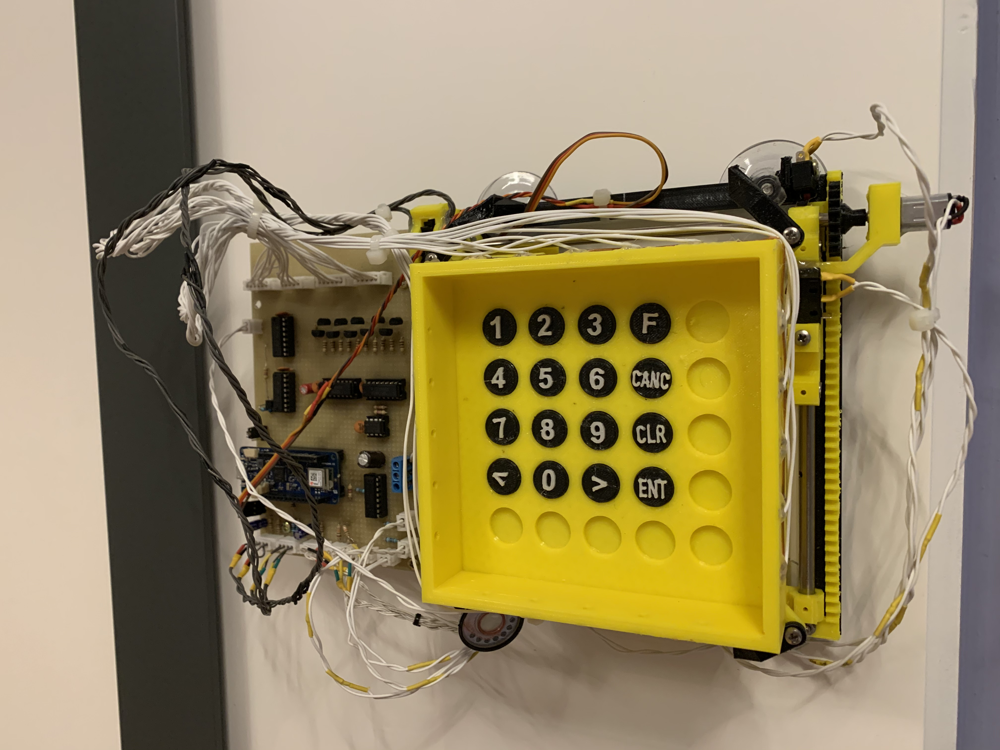

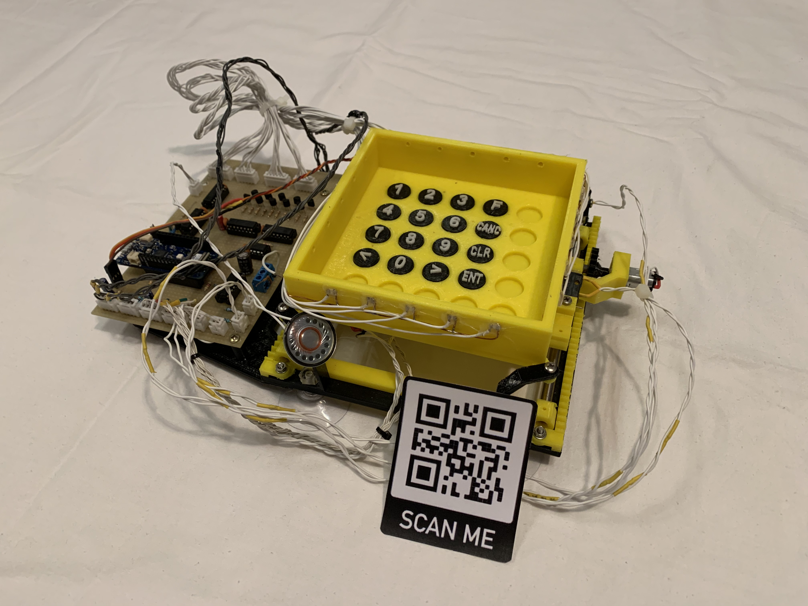

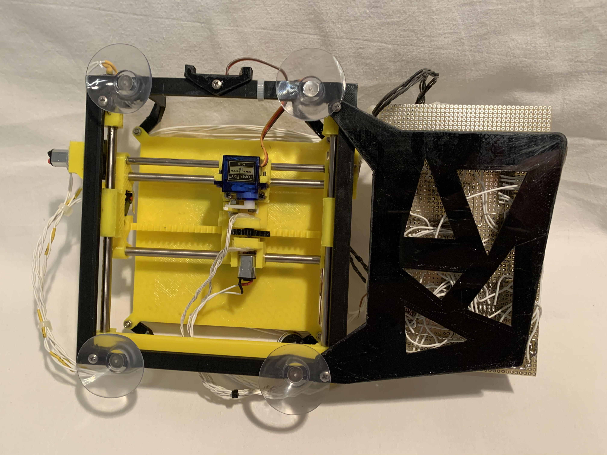

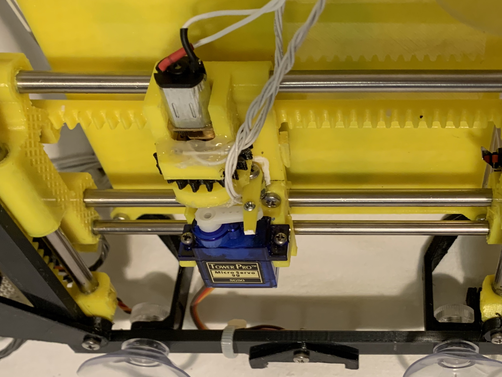